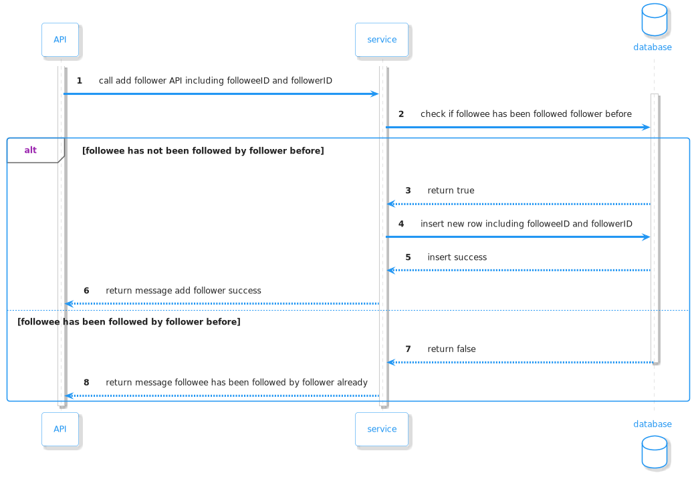
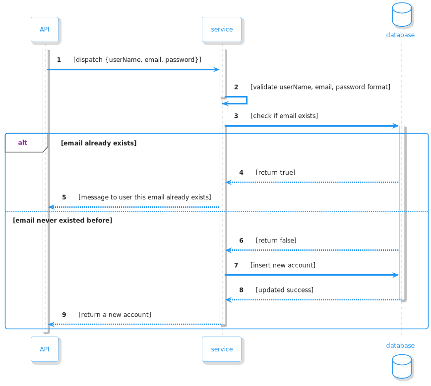
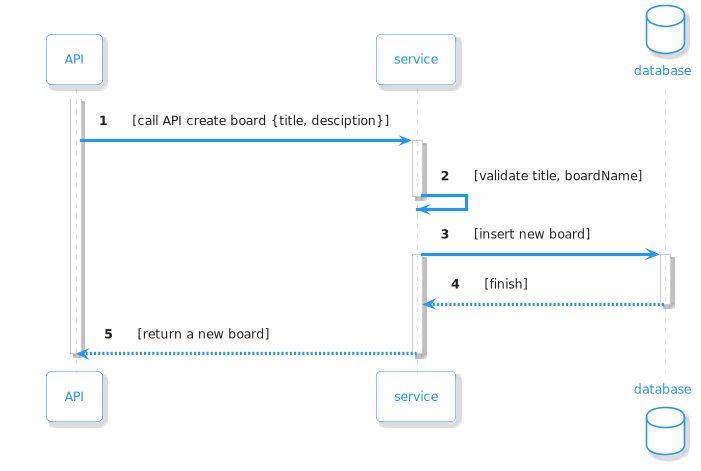
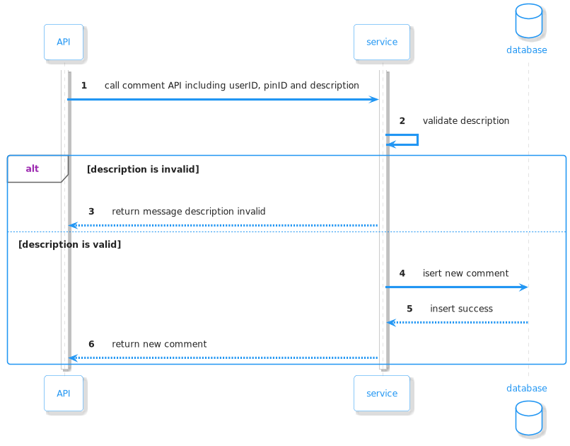
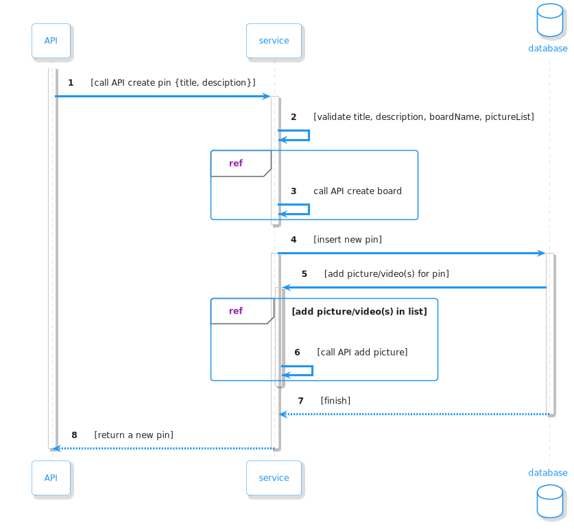
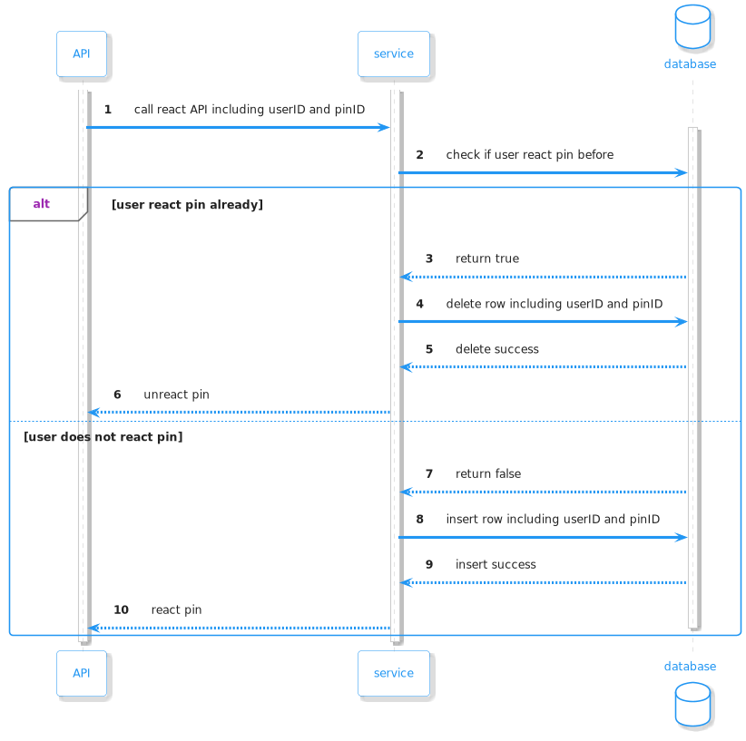
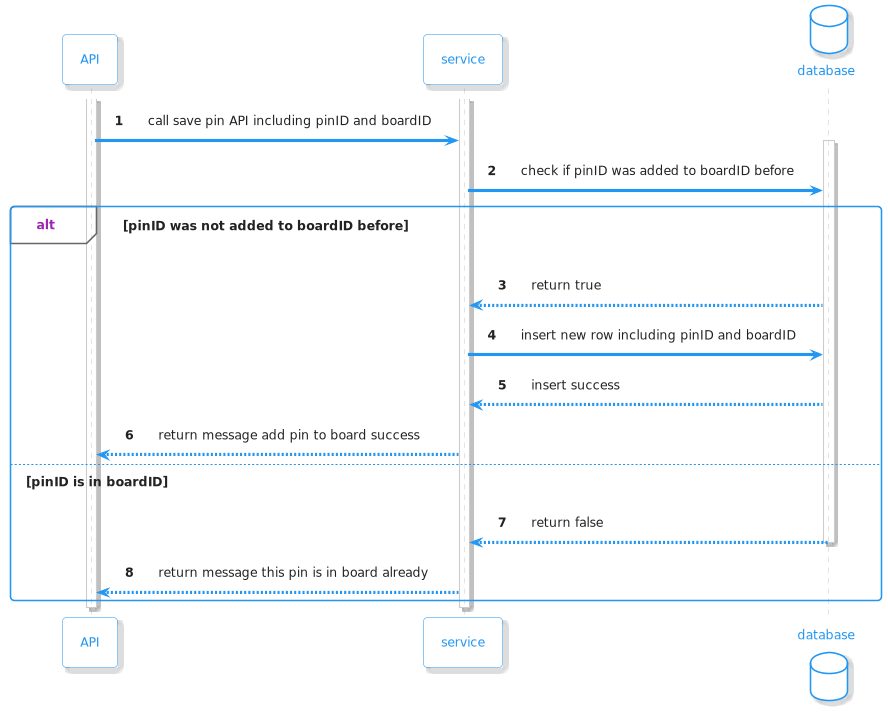
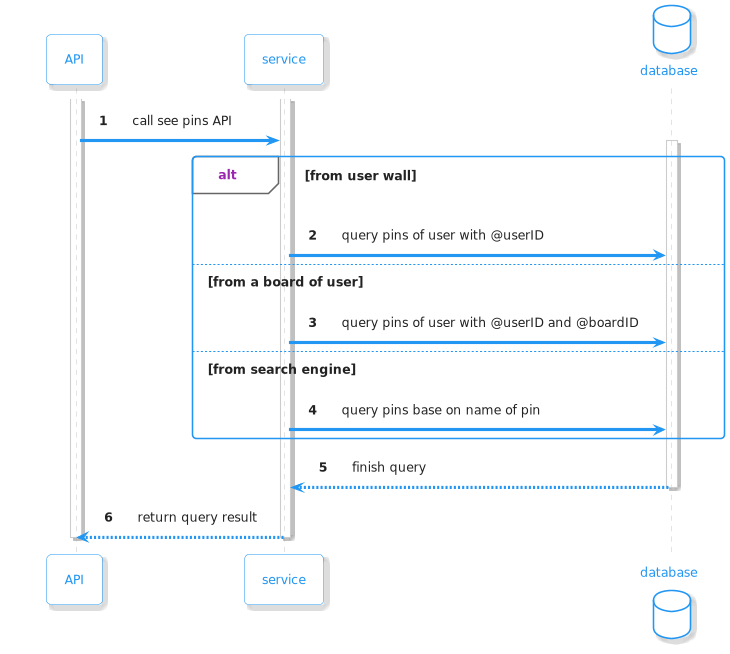

# Assignment

## Problem statement

Design schema for photo sharing program, almost like [Pinterest](https://pinterest.com), details as follows:

- Users share images by creating a pin (pin) with title, description, images, and pins.
- The generated pin must be on a certain board. The board can be either public or private: other users cannot see the pin in the board. However, the private board can invite other users to collaborate: create pins, reply to comments, . . .
- User can save another user's pin to his board.
- User can comment, like pins.
- User can follow many other users.

## Requirements

- Analyze requirements, then design APIs, database schema.
- Each API designs possible (tuned) queries, drawing workflows using planUML or drawio
- Design sharding on the application layer.
- Write detailed documentation of database schema, queries, sharding.

### Feature requests

- Create an account (username/password, email, ...)
- Allows user to create, view pin, create board.
- Users can save other people's pins.
- Users can follow others.
- For users to use comments, like the pin

## Solution

|            |
|:----------------------------------------------:| 
| Relational table diagram for `PinterestClone`  |

Document: <https://dbdocs.io/andrena2209/PinterestClone>

### Some APIs 

|  |
|:------------:|
| add follower |

|      |
|:---------------------------------:|
| create a new account              |

|  |
|:------------:|
| create board |

|  |
|:-------------------------------:|
|         create comment          |

|  |
|:---------------------------:|
|         create pin          |

|  |
|:--------------------------:|
|         react pin          |

|  |
|:------------:|
|   save pin   |

|   |
|:--------------------------:|
|          see pins          |
